## About this lab

### Automate container creation in AWS ECR

This lab using a Cloudformation Stack to generate the following items:
* A VPC to run Batch instance
* ECR Repository to push image
* Lambda Function as the handler to trigger initial Batch job

**This lab would take you 20 mins to complete all the components and setting up the resources** 

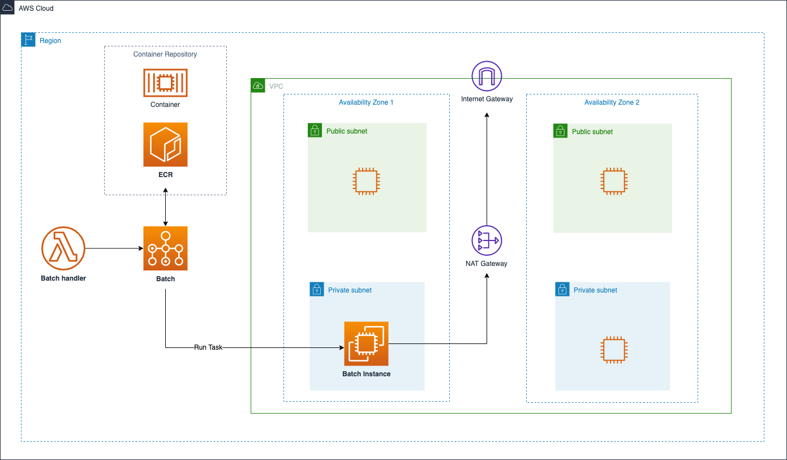

### Prerequisites

* You must have an AWS account and an IAM user with sufficient permissions to interact with the AWS Management Console

* Download the CloudFormation stack **container_creation.yml**

* **Make sure to launch the CloudFormation stack in Singapore (ap-southeast-1) region**

### CloudFormation Deployment

* On the service menu, click **CloudFormation**
* For **Prepare template**, choose **Template is ready**
* For **Specify template**, select **Upload a template file** and select **Choose file**.
* Choose the **datalake_qs.yml**
* Click **Next**
* Enter the values in each Parameters and create the stack.

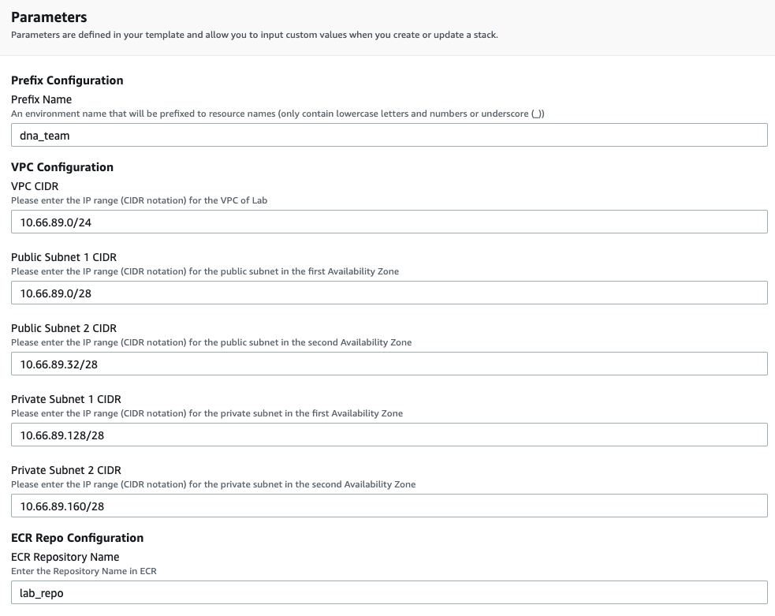

*Please follow the instruction to fill in the parameters*

**Prefix Configuration**

Parameters                 | Description  |   Default    |
---------------------------|:-------------|:------------:|
Prefix Name                |       An environment name that will be prefixed to resource names (only contain lowercase letters and numbers or underscore (_))      |       dna_team       |

Enter a unique name to prefixed to the resources

**VPC Configuration**

Parameters     | Description  |   Default    |
---------------|:-------------|:------------:|
VPC CIDR       |       Please enter the IP range (CIDR notation) for the VPC of Lab      |      10.66.89.0/24        |
Public Subnet 1 CIDR       |      Please enter the IP range (CIDR notation) for the public subnet in the first Availability Zone        |       10.66.89.0/28       |
Public Subnet 2 CIDR       |       Please enter the IP range (CIDR notation) for the public subnet in the second Availability Zone       |       10.66.89.32/28       |
Private Subnet 1 CIDR       |       Please enter the IP range (CIDR notation) for the private subnet in the first Availability Zone       |     10.66.89.128/28      |   
Private Subnet 2 CIDR       |       Please enter the IP range (CIDR notation) for the private subnet in the second Availability Zone      |     10.66.89.160/28      |   

For lab quick starter
* Leave all parameters as default

**ECR Repo Configuration**

Parameters                 | Description  |   Default    |
---------------------------|:-------------|:------------:|
ECR Repository Name                |       Enter the Repository Name in ECR      |       lab_repo       |

Enter a unique name for your ECR repository or leave it as default

* After entering all the parameter values, choose **Next**
* On the next screen, enter any required tags, an IAM role, or any advanced options, and then choose **Next**
* Review the details on the final screen, **select I acknowledge that AWS CloudFormation might create IAM resources**, and then choose **Create Stack**

* CloudFormation will start to build all resources (stack creation would take 3 - 5 mins)

***

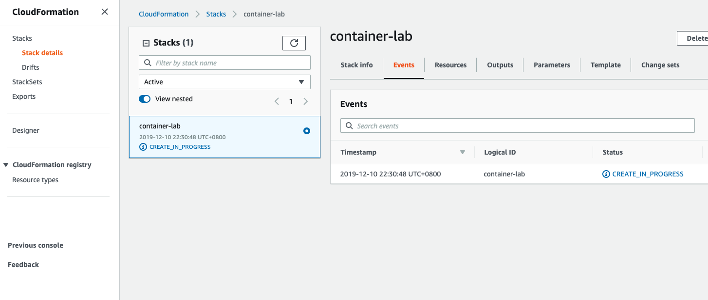

Check the AWS CloudFormation Resources section to see all the components set up by this stack 

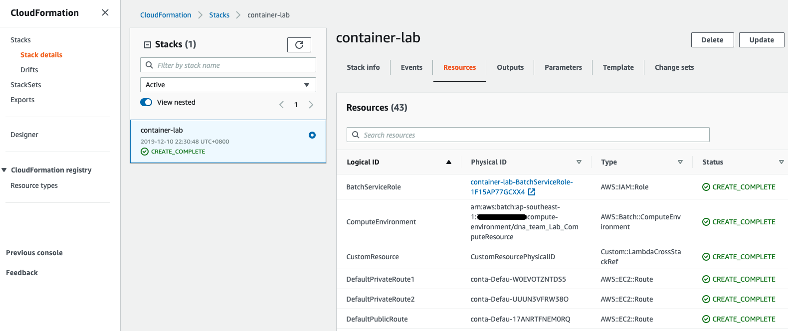

Examine the new resources via console

**VPC**

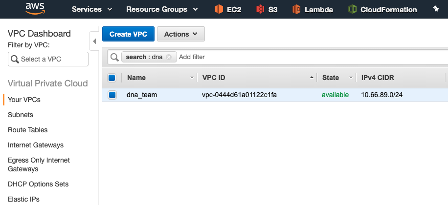

**ECR**

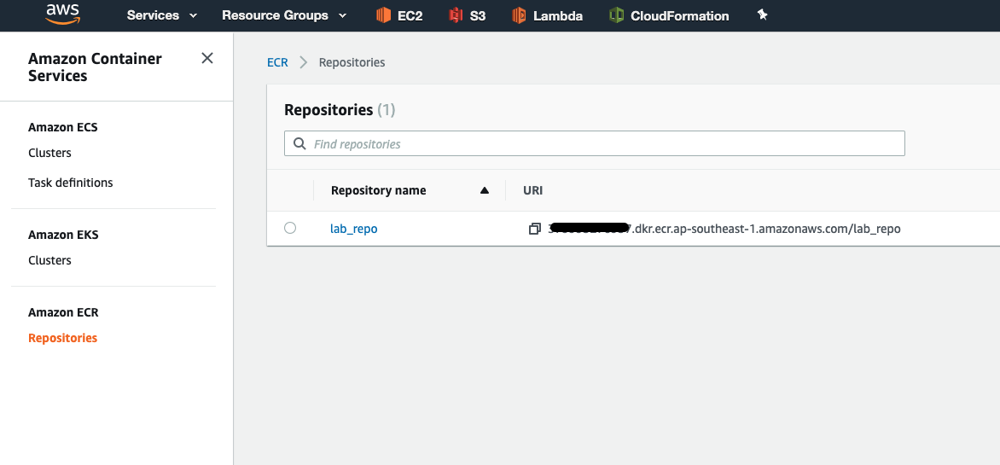

**Batch**

**Lambda**

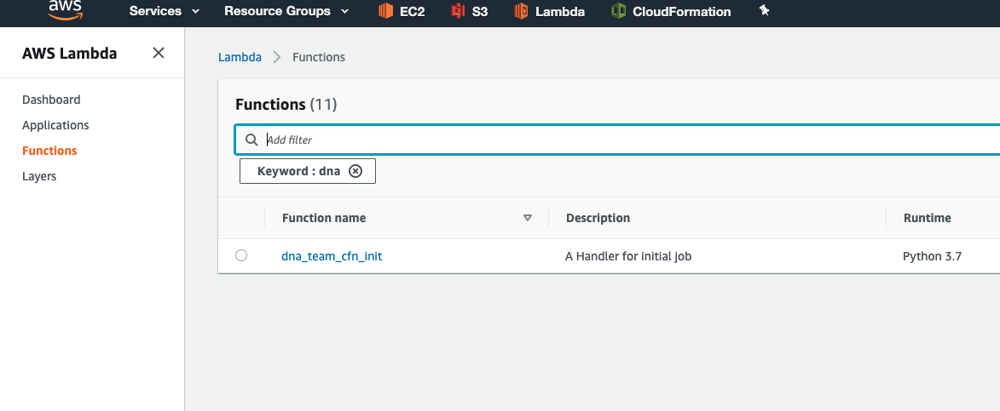

***

*Check if the initial Batch job run succeeded and create the new container image in **ECR***

* On the service menu, click **Batch**
* On the Dashboard, there will have a job queue which is created by CloudFormation

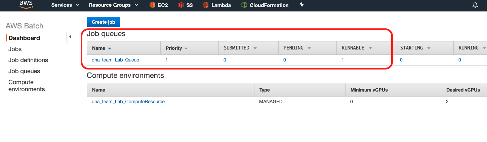

* Click **Jobs** on the left navigation panel
* A job name **container_builder** will show up in one of those status tabs
* For most of the cases, the job will be at **runnable** status for a while and then start running 
* Wait for the job start to run and it will finish at **SUCCEEDED** status

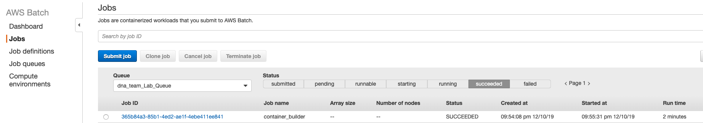

* Back to the service menu, click **ECR**
* Click the new repository (e.g. **lab_repo**) which have been created by cloudFormation

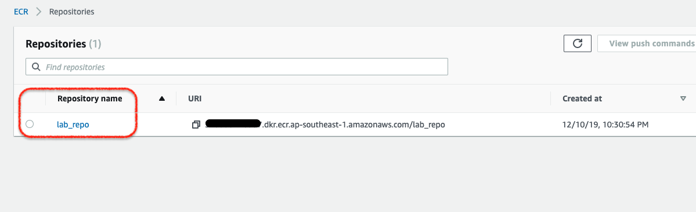

* An image will show up which tag as **latest** and the **pushed at time** is within the time when Batch job is running

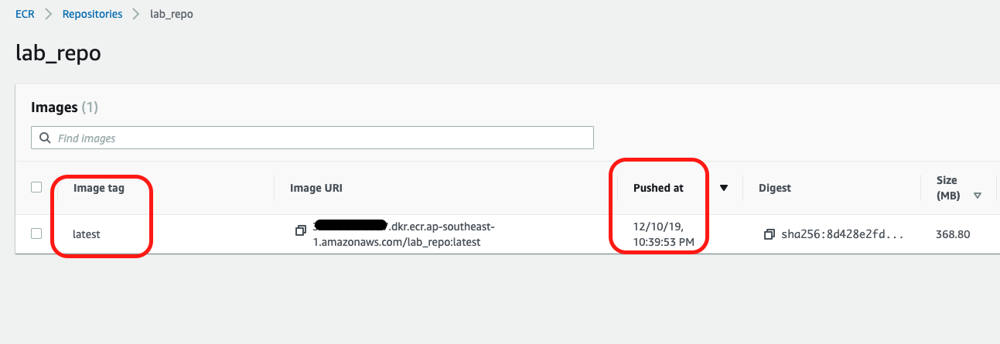

**Congratulations, it means you successfully push a custom container image to AWS ECR**

***

*Check if new container image can run Python script and make an API call to AWS boto3 library*

* On the service menu, click **Batch**
* Click **Jobs** on the left navigation panel
* Click **Submit job**
* For **Job name**, enter your job name
* For **Job definition**, select **Lab_Demo**
* for **Job queue**, select the queue that have been created by Cloudformation
* And then click **Submit Job** at the bottom

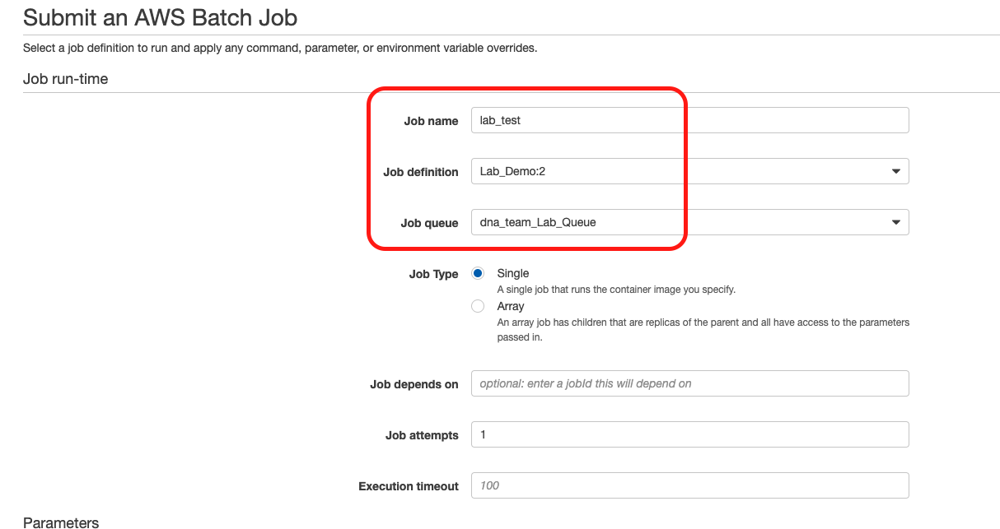

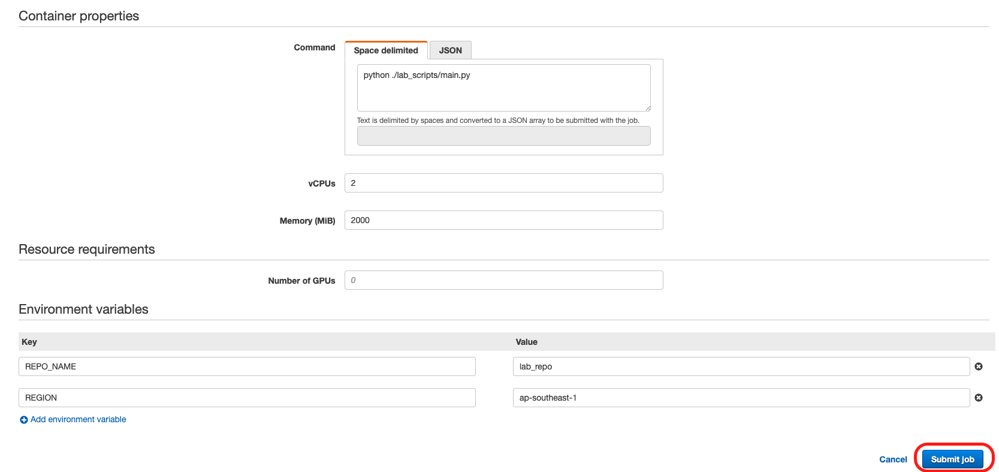

* Batch will submit a new job which runs the task in your custom container
* For most of the cases, the job will be at **runnable** status for a while and then start running

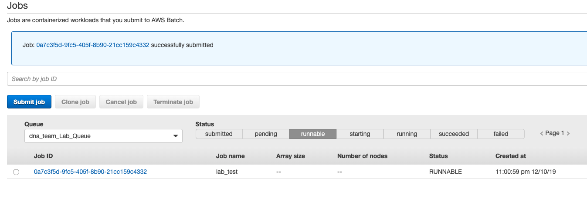

* Wait for the job start to run and it will finish at **SUCCEEDED** status

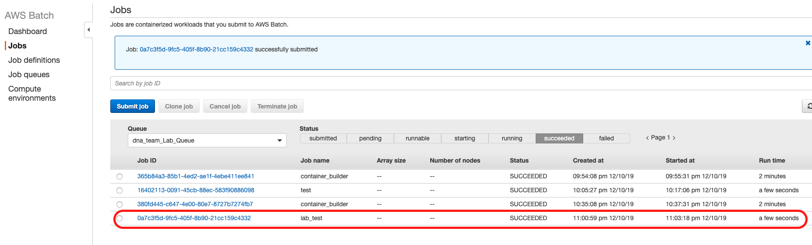

* Click the **Job ID** in the succeeded list
* Click the **View logs** at the bottom

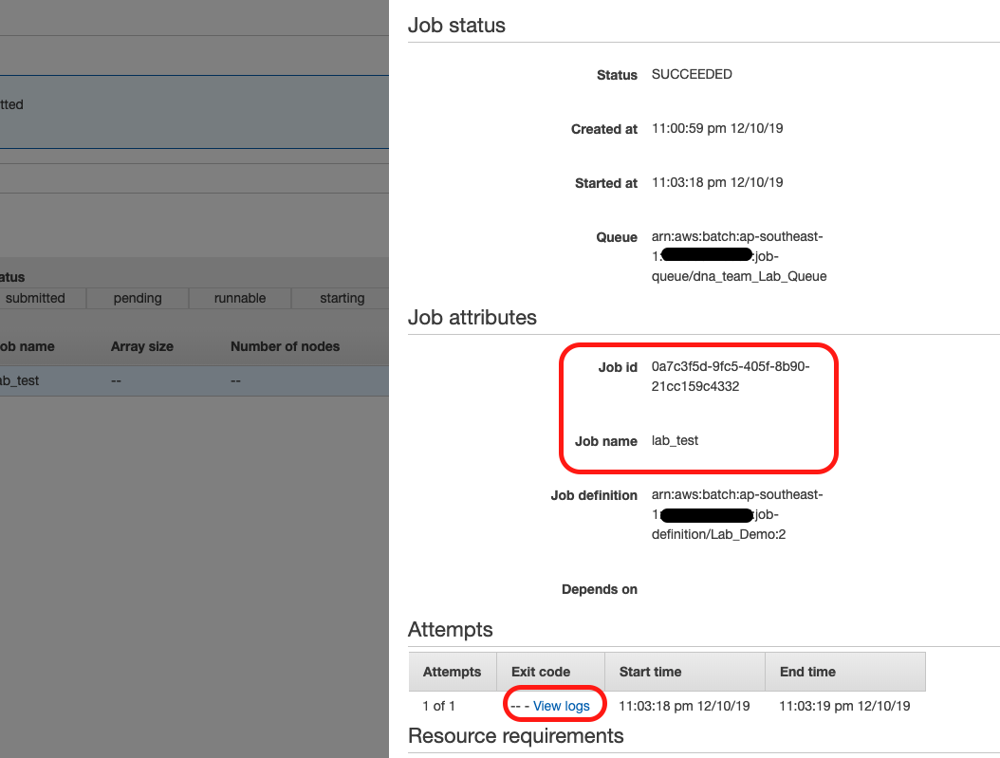

* The screen will be redirected to CloudWatch Log page
* The log will record and print some metadata of the container manifest
* At the bottom, you will find a log which prints out the message as below 

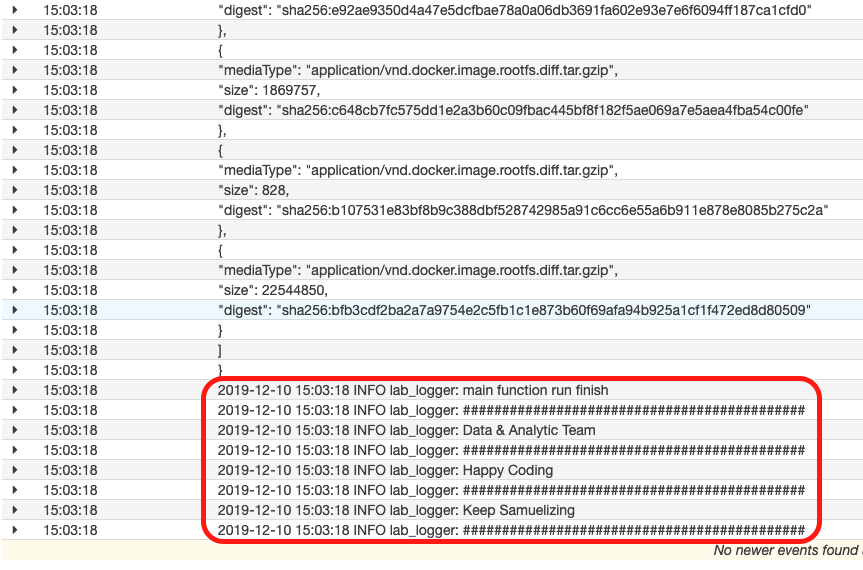

        Data & Analytic Team
        Happy Coding
        Keep Samuelizing

### Clean-Up Operation Procedures

* On the service menu, click **CloudFormation**
* On AWS CloudFormation console make sure that the region is where you created the stack
* Click **Delete** to remove the stack along with all resources

* **The deletion time will take 3 mins to 5 mins**