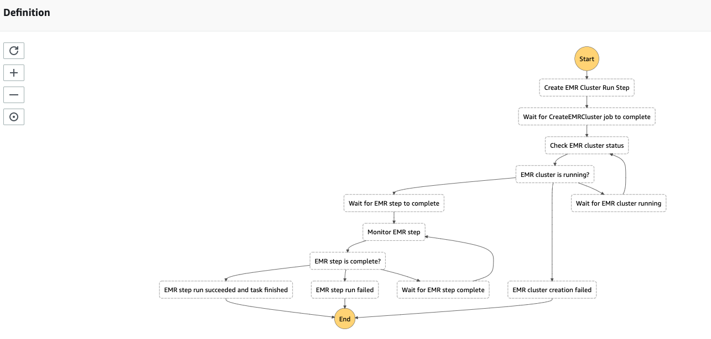
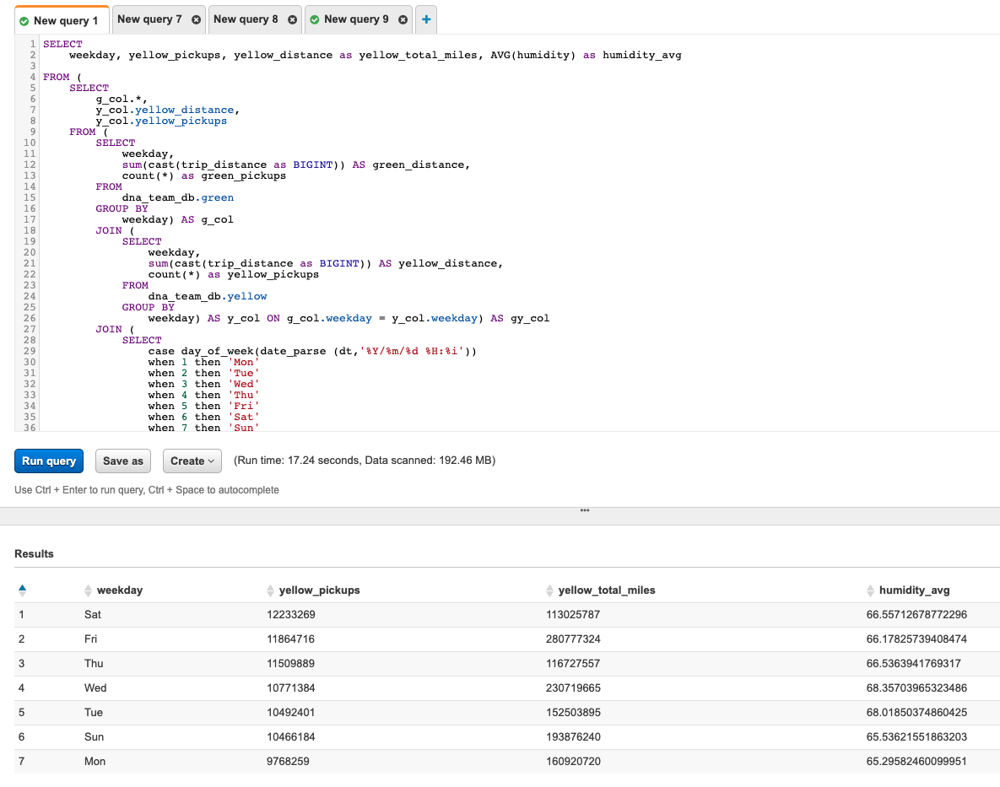

## About this lab

### AWS Data Lake quickstart

This lab using a Cloudformation Stack to generate the following items:
* Data lake storage bucket
* Glue data catalog with metadata definition
* Data transfer instance in VPC private subnet
* Step function as task monitor
* Lambda Function as the handler for Step function

**This lab would take you 40 mins to 50 mins to complete all the components and setting up the resources** 

**This lab using the following datasets from Kaggle and NYC gov**
* https://www.kaggle.com/selfishgene/historical-hourly-weather-data#city_attributes.csv

    
* https://www1.nyc.gov/site/tlc/about/tlc-trip-record-data.page

    

### Prerequisites

* You must have an AWS account and an IAM user with sufficient permissions to interact with the AWS Management Console

* Create an EC2 key pair for the bastion if you do not have one in this AWS Region, create it before continuing
    * [How to create EC2 key pairs](https://docs.aws.amazon.com/zh_tw/AWSEC2/latest/UserGuide/ec2-key-pairs.html)

* Download the CloudFormation stack **datalake_qs.yml**

### CloudFormation Deployment

* On the service menu, click **CloudFormation**
* For **Prepare template**, choose **Template is ready**
* For **Specify template**, select **Upload a template file** and select **Choose file**.
* Choose the **datalake_qs.yml**
* Click **Next**
* Enter the values in each Parameters and create the stack.

*Please follow the instruction to fill in the parameters*

**Prefix Configuration**

Parameters                 | Description  |   Default    |
---------------------------|:-------------|:------------:|
Prefix Name                |       An environment name that will be prefixed to resource names (only contain lowercase letters and numbers or underscore (_))      |       dna_team       |

Enter a unique name to prefixed to the resources

**VPC Configuration**

Parameters     | Description  |   Default    |
---------------|:-------------|:------------:|
VPC CIDR       |       Please enter the IP range (CIDR notation) for the VPC of Lab      |      10.66.89.0/24        |
Public Subnet 1 CIDR       |      Please enter the IP range (CIDR notation) for the public subnet in the first Availability Zone        |       10.66.89.0/28       |
Public Subnet 2 CIDR       |       Please enter the IP range (CIDR notation) for the public subnet in the second Availability Zone       |       10.66.89.32/28       |
Private Subnet 1 CIDR       |       Please enter the IP range (CIDR notation) for the private subnet in the first Availability Zone       |     10.66.89.128/28      |   
Private Subnet 2 CIDR       |       Please enter the IP range (CIDR notation) for the private subnet in the second Availability Zone      |     10.66.89.160/28      |   

For lab quick starter
* Leave all parameters as default

**EC2 Data Transfer Server Configuration**

Parameters                                | Description  |   Default    |
------------------------------------------|:-------------|:------------:|
EC2 Key Pair               |      Choose an existing key pair.      |         |
EC2 Instance Type               |      Select one of the instance types      | t2.micro        |

Select your EC2 Key Pair in **Key Pair Name**

**S3 Data Lake Storage Configuration**

Parameters                 | Description  |   Default    |
---------------------------|:-------------|:------------:|
S3 Data Lake Bucket Name                |       Please enter a **UNIQUE** bucket name to create a data repository for S3      |       datalake-lab-bucket-ver6689       |

Enter a unique name to create the data lake bucket

**SNS Email Target Configuration**

Parameters                 | Description  |   Default    |
---------------------------|:-------------|:------------:|
SNS Email Target                |       Enter the Email address for the target of SNS notification       |      sam@ecloud6689.com        |

Enter your mail address to receive the notification

* After entering all the parameter values, choose **Next**
* On the next screen, enter any required tags, an IAM role, or any advanced options, and then choose **Next**
* Review the details on the final screen, **select I acknowledge that AWS CloudFormation might create IAM resources**, and then choose **Create Stack**

* CloudFormation will start to build all resources (stack creation would take 5 - 10 mins)

### It's Coffee time :))

***

Check the AWS CloudFormation Resources section to see all the components set up by this stack 

Also, check the output from the stack creation

Examine the new resources via console

**S3**

**Step Function**

**Lambda**

**EC2**

***
* When CloudFormation complete the creation, a Lambda function will be triggered to execute **Step Function**

* Step Function will use another Lambda function to run a job flow for **EMR ingestion job** with multiple steps which including
    * Setup debugging (about 2 mins)
    * Setup copy files (about 2 mins)
    * Run Spark application (about 15 mins)

*Monitor the EMR job status with **Step Function** workflow* (Totally about **30 mins**)

As illustrated in the preceding diagram, the workflow including

1. **Create EMR Cluster Run Step**

    * Triggered by Lambda function

2. **Wait for EMR to create the cluster**

    

    * Wait for 300 secs
3. **Check EMR cluster status**

    * Wait for 15 secs if the EMR cluster hasn't run

    

    * End the EMR job if cluster create failed

4. **Wait for EMR step to complete**

    * Wait for 600 secs (**Spark application will take about 15 - 20 mins**)

    
    
5. **Monitor EMR step (3 step will take about 20 mins)**
    * End the job if all steps run succeed

    

    The Glue crawler will be triggered to create the 3 Glue tables after all the steps are done 

    

    

    A Lambda function will be triggered to terminate EMR cluster when the job is done

    

    * End the job if any step run failed
    * Wait for 15 secs if Spark application is still running

***

*The following step introduces how to use **Athena** query the S3 data lake*

* On the service menu, click **Athena**
* Select the database(with the prefix e.g. **dna_team_db**) in the **Database** blank

* Three tables will be displayed in the table list
    * **Green**
        * The half-year New York green taxi data in 2015
            * (from EMR Spark ingestion job)
    * **Weather**
        * The weather data from 30 US and Canadian Cities
            * (from EC2 data copy job)
    * **Yellow**
        * The half-year New York yellow taxi data in 2015
            * (from EMR Spark ingestion job)

* Run the following query to gain some insights into those tables (replace the **dna_team_db** with your db name)
    * Weekday analysis of yellow taxi
        
            SELECT
                weekday,
                yellow_pickups,
                yellow_distance as yellow_total_miles,
                AVG(humidity) as humidity_avg
            FROM (
                SELECT
                    g_col.*,
                    y_col.yellow_distance,
                    y_col.yellow_pickups
                FROM (
                    SELECT
                        weekday,
                        sum(cast(trip_distance as BIGINT)) AS green_distance,
                        count(*) as green_pickups
                    FROM
                        dna_team_db.green
                    GROUP BY
                        weekday) AS g_col
                    JOIN (
                        SELECT
                            weekday,
                            sum(cast(trip_distance as BIGINT)) AS yellow_distance,
                            count(*) as yellow_pickups
                        FROM
                            dna_team_db.yellow
                        GROUP BY
                            weekday) AS y_col ON g_col.weekday = y_col.weekday) AS gy_col
                    JOIN (
                        SELECT
                            case day_of_week (date_parse (dt,
                                    '%Y/%m/%d %H:%i'))
                            when 1 then
                                'Mon'
                                when 2 then
                                'Tue'
                                when 3 then
                                'Wed'
                                when 4 then
                                'Thu'
                                when 5 then
                                'Fri'
                                when 6 then
                                'Sat'
                                when 7 then
                                'Sun'
                            end as weekday_type,
                            new_york AS humidity
                        FROM
                            dna_team_db.weather) AS gyw_col ON gy_col.weekday = gyw_col.weekday_type
                    group by
                        weekday,
                        yellow_distance,
                        yellow_pickups
                    order by
                        yellow_pickups DESC

    * The run time will be around 20 secs

    

    * People in New York may tend to take more yellow taxi on Saturday more than other days

    * People in New York take a lesser yellow taxi on Monday than other days

    ***

    * Humidity analysis of green taxi

            SELECT
                gyw_col.humidity,
                sum(gy_col.green_taxi_pickups) as green_pickup_sum
            FROM (
                SELECT
                    g_col.*,
                    y_col.yellow_taxi_pickups
                FROM (
                    SELECT
                        date_trunc('hour', lpep_pickup_datetime) AS date,
                        Count(*) AS green_taxi_pickups
                    FROM
                        dna_team_db.green
                    GROUP BY
                        1) AS g_col
                    JOIN (
                        SELECT
                            date_trunc('hour', tpep_pickup_datetime) AS date,
                            Count(*) AS yellow_taxi_pickups
                        FROM
                            dna_team_db.yellow
                        GROUP BY
                            1) AS y_col ON g_col.date = y_col.date) AS gy_col
                    JOIN (
                        SELECT
                            date_parse (dt,
                                '%Y/%m/%d %H:%i') as datetime,
                            new_york AS humidity
                        FROM
                            dna_team_db.weather) AS gyw_col ON gy_col.date = gyw_col.datetime
                    group by
                        gyw_col.humidity
                    order by
                        green_pickup_sum DESC
                    limit 10

    * The run time will be around 20 secs

     

    * When the humidity is higher than 90, the total amount of pickups by green taxi is directly proportional to the humidity

* Feel free to play around with the data, you can write your own SQL query and explore more interesting information about the table

### Clean-Up Operation Procedures

* Find the S3 Bucket for Redshift which was created by CloudFormation template.
    * (e.g., datalake-lab-bucket-ver6689)

* Delete all object in the bucket and make sure the bucket is empty

* On the service menu, click **CloudFormation**
* On AWS CloudFormation console make sure that the region is where you created the stack
* Click **Delete** to remove the stack along with all resources

* **The deletion time will take 5 mins to 10 mins**

### Lab References
* [awslab - amazon-s3-step-functions-ingestion-orchestration](https://github.com/awslabs/amazon-s3-step-functions-ingestion-orchestration)
* [aws big data blog - Orchestrate Apache Spark applications using AWS Step Functions and Apache Livy](https://aws.amazon.com/blogs/big-data/orchestrate-apache-spark-applications-using-aws-step-functions-and-apache-livy/)