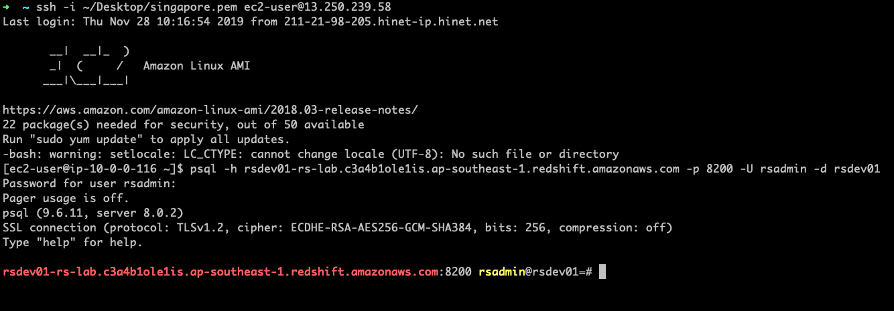
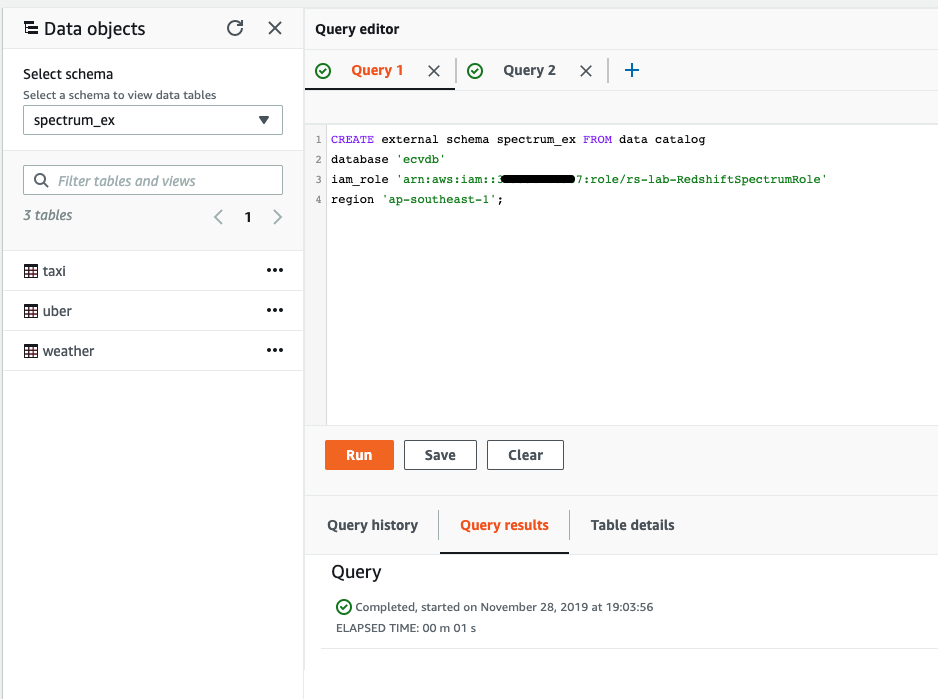
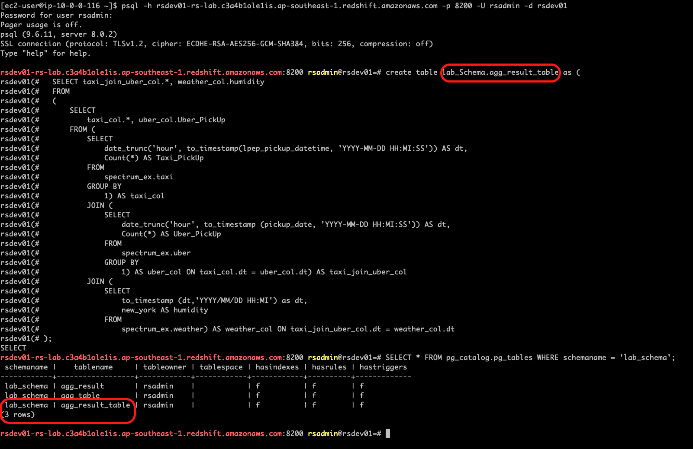

## About this lab

### Deploy Amazon Redshift Cluster and highly available SSH bastion host in 3 AZs

This lab using a Cloudformation Stack to generate the following items:

* A VPC with public and private subnets in 3 AZs
* Highly available SSH bastion host
* Amazon Redshift Cluster

**This lab would take you 40 mins to 1 hr to complete all the components and setting up the resources** 

### Prerequisites
* You must have an AWS account and an IAM user with sufficient permissions to interact with the AWS Management Console

* The region of CloudFormation deployment must support **Redshift spectrum**
    * [The region that supports Redshift Spectrum](https://docs.aws.amazon.com/zh_tw/redshift/latest/dg/c-using-spectrum.html)

* Create an EC2 key pair for the bastion if you do not have one in this AWS Region, create it before continuing
    * [How to create EC2 key pairs](https://docs.aws.amazon.com/zh_tw/AWSEC2/latest/UserGuide/ec2-key-pairs.html)

* Download the CloudFormation stack **redshift_automation.yml**

### CloudFormation Deployment
* On the service menu, click **CloudFormation**
* For **Prepare template**, choose **Template is ready**
* For **Specify template**, select **Upload a template file** and select **Choose file**.
* Choose the **redshift_automation.yml**
* Click **Next**
* Enter the values in each Parameters and create the stack.

*Please follow the instruction to fill in the parameters*

**Environment**

Parameters                 | Description  |   Default    |
---------------------------|:-------------|:------------:|
Environment                |       The environment tag that is used to designate the environment stage of the associated AWS resource. e.g.  Development, Production      |       Development       |

Choose an environment tag to prefixed to the resources

**VPC Parameters**

Parameters                                | Description  |   Default    |
------------------------------------------|:-------------|:------------:|
ClassB 2nd Octet (VPC CIDR)               |      Specify the 2nd Octet of IPv4 CIDR block for the VPC (10.XXX.0.0/16) in the range [0-255]        |       0       |

For Redshift novice or lab quick starter
* Leave **ClassB 2nd Octet (VPC CIDR)** as default

**Network Configuration**

Parameters                                | Description  |   Default    |
------------------------------------------|:-------------|:------------:|
Allowed Bastion External Access CIDR      |     Allowed CIDR block in the x.x.x.x/x format for external SSH access to the bastion host         |       211.21.98.205/32       |

Change **Allowed Bastion External Access CIDR** to your IP

**Amazon EC2 Configuration**

Parameters                 | Description  |   Default    |
---------------------------|:-------------|:------------:|
Key Pair Name              |       Enter a Public/private key pair. If you do not have one in this AWS Region, create it before continuing   |              |
Bastion Instance Type      |       Amazon EC2 instance type for the bastion instance. t2 instance types are not supported for dedicated VPC tenancy (option below). |        t2.micro      |
LogsRetentionInDays        |       Specify the number of days you want to retain log events       |       14       |

For Redshift novice or lab quick starter
* Leave **Bastion Instance Type** and **LogsRetentionInDays** as default
 
Select your EC2 Key Pair in **Key Pair Name**

**Linux Bastion Configuration**

Parameters                 | Description  |   Default    |
---------------------------|:-------------|:------------:|
Bastion Tenancy            |       VPC Tenancy in which bastion host will be launched. Options: 'dedicated' or 'default'       |       default       |
Enable Banner              |       To include a banner to be displayed when connecting via SSH to the bastion, set this parameter to true|       true       |
Bastion Banner             |       Banner text to display upon login. Use default or provide AWS S3 location for the file containing Banner text.       |       https://aws-quickstart.s3.amazonaws.com/quickstart-linux-bastion/scripts/banner_message.txt       |
Enable TCP Forwarding      |       Enable/Disable TCP Forwarding       |   false         |
EnableX11Forwarding        |      Enable/Disable X11 Forwarding   |       false       |
Custom Bootstrap Script    |       Optional. Specify custom bootstrap script AWS S3 location to run during bastion host setup       |              |
AMI override               |       Optional. Specify a region specific image to use for the instance       |              |

For Redshift novice or lab quick starter
* Leave **all parameters** as default

**Amazon Redshift Parameters**

Parameters                              | Description  |   Default    |
----------------------------------------|:-------------|:------------:|
Node type for Redshift cluster          |       The type of node to be provisioned       |       dc2.large       |
Number of nodes in Redshift cluster     |       The number of compute nodes in the cluster. For multi-node clusters, the NumberOfNodes parameter must be greater than 1.|       2       |
Redshift cluster port                   |       The port number on which the cluster accepts incoming connections.       |       8200       |
Redshift database name                  |      The name of the first database to be created when the cluster is created.        |       rsdev01       |
Redshift master user name               |       The user name that is associated with the master user account for the cluster that is being created       |       rsadmin       |
Redshift master user password           |      The password that is associated with the master user account for the cluster that is being created. It must contain one uppercase letter, one lowercase letter, and one number. For example, Welcome123. |              |

For Redshift novice or lab quick starter
* Leave **Node type for Redshift cluster**, **Number of nodes in Redshift cluster**, **Redshift cluster port** as default

Remember to modify the following parameters
* **Redshift database name** 
    * e.g. =>  ecvdb01
* **Redshift master user name** 
    * e.g. => ecv
* **Redshift master user password**
    * e.g. => Ecv6689

**Amazon Redshift Advanced Parameters**

Parameters                              | Description  |   Default    |
----------------------------------------|:-------------|:------------:|
Enable Redshift logging to S3           |       Enables or disables logging to an S3 bucket. To enable logging, select True.       |        false      |
Max number of concurrent clusters       |      The maximum number of concurrency scaling Redshift clusters.        |        1      |
Encryption at rest                      |       Enables or disables encryption at rest of the Redshift database.|       false       |
KMS key ID                              |      The existing KMS key ID for encrypting Redshift database at-rest.        |              |
Redshift snapshot identifier            |       The Redshift snapshot identifier. Leave this blank for a new cluster. Enter the snapshot identifier, only if you want to restore from a snapshot.       |              |
AWS account-ID of the Redshift snapshot |      The AWS account number where the Redshift snapshot was created. Leave this blank, if the snapshot was created in the current AWS account.        |              |
Redshift maintenance window             |       Maintenance Window for Redshift Cluster       |      sat:05:00-sat:05:30        |
Amazon S3 bucket for Redshift IAM role  |       Create an Amazon S3 bucket for Redshift Spectrum (enter a unique bucket name). An IAM role will be created and associated to the Redshift cluster with GET and LIST access to this bucket.       |      e.g., redshift-spectrum-bucket-ver6689        |
Glue catalog database name              |      The name of your Glue Data Catalog database.        |              |

For Redshift novice or lab quick starter
* Leave following parameters as default
    * **Enable Redshift logging to S3**
    * **Max number of concurrent clusters**
    * **Encryption at rest**
    * **KMS key ID**
    * **Redshift snapshot identifier**
    * **AWS account-ID of the Redshift snapshot**
    * **Redshift maintenance window**

Enter the name of following parameters
* **Glue catalog database name** (e.g. ecvdb)
* **Amazon S3 bucket for Redshift IAM role** (e.g., redshift-spectrum-bucket-ver6689)
    * Make sure to enter a unique name to create the new bucket

**Tag Identifiers**

Parameters                 | Description  |   Default    |
---------------------------|:-------------|:------------:|
Unique friendly name       |      The unique friendly name which will be added to the environment tag.        |       redshift       |
Functional tier            |      The functional tier of the associated AWS resource.|       data       |
Confidentiality classifier |      The confidentiality classification of the data that is associated with the resource.        |       private       |

You can name your tag as you want

**Amazon SNS Configuration**

Parameters                 | Description  |   Default    |
---------------------------|:-------------|:------------:|
SNS Notification Email     |      The Email notification list is used to configure a SNS topic for sending cloudwatch alarm notifications        |              |

Enter your mail address to receive the notification

* After entering all the parameter values, choose **Next**
* On the next screen, enter any required tags, an IAM role, or any advanced options, and then choose **Next**
* Review the details on the final screen, **select I acknowledge that AWS CloudFormation might create IAM resources**, and then choose **Create Stack**

* CloudFormation will start to build all resources (stack creation would take 10 - 20 mins depends on the Redshift)

### It's Coffee time :))

***

Check the AWS CloudFormation Resources section to see all the components set up by this stack 

Also, check the output from the stack creation

Examine the new resources via console

**Redshift**

**EC2 Bastion**

**Auto Scaling Group**

**S3**

**Glue**

*The following step introduces how to connect to the Redshift and using Redshift Spectrum*

**Login to Redshift using bastion host**

* Move the private key of the EC2 key pair (that you saved in the Prerequisites section) to a location on your SSH Client, where you are connecting to the Amazon Linux bastion host.

* Change the permission of the private key using the following command, so that it’s not publicly viewable.

        chmod 400 <private key file name, e.g., bastion-key.pem >

* In the CloudFormation console, choose **Outputs** and make a note of the **SSHCommand** parameter value, which you use to apply SSH to the Amazon Linux bastion host.

* On the SSH client, change the directory to the location where you saved the EC2 private key, and then copy and paste the **SSHCommand** value from the previous step.

* On the CloudFormation Dashboard, choose **Outputs** and note the **PSQLCommandLine** parameter value

* The EC2 Auto Scaling launch configuration already set up PostgreSQL binaries on the Amazon Linux bastion host. Copy and paste the **PSQLCommandLine** value at the command prompt of the bastion host.

            psql -h ClusterEndpointAddress -p AmazonRedshiftClusterPort -U Username -d DatabaseName
    When prompted, enter the database user password.

* Run some basic commands, as shown in the following screenshot:

        select current_database();
            
        select current_user;

**How to use Redshift Spectrum?**

You can use the following options to run the query
* **Command line interface**
    * Keep using your terminal which already login into psql client
        * Remember to add **`;`** at the end of SQL command 

* **Redshift query editor** 
    * Using the left navigation pane on the Amazon Redshift console, navigate to the Query Editor.
    * In the **Credentials** dialog box, in the **Cluster** drop-down list, choose the cluster name.
    * Enter the db name in **Database User**
    * Enter the user name in **Password**
    * Choose **Connect**

* On the CloudFormation Dashboard, choose **Outputs** and note the **SQLCreateExternalSchemaCommand** parameter value

* Run SQL command above to create an external schema for Redshift at first
    
        create external schema spectrum_ex from data catalog
        database '<GlueCatalogDBName>'
        iam_role '<RedshiftIAMRoleArn>'
        region '<Current AWS Region>';

    * **Replace the <> value as below**
        * Your Glue Database Name
        * Your Redshift IAM Role Arn
        * Your AWS Region

    The SQL would be like below

        create external schema spectrum_ex from data catalog
        database 'ecvdb'
        iam_role 'arn:aws:iam::668966896689:role/rs-lab-RedshiftSpectrumRole'
        region 'ap-southeast-1';

*Via command line*

*Via AWS console*

* Wait for the query running until it is completed 
* Select the your new schema name in the **select schema** blank

* The Glue tables will show up in the navigation plan 

* Run a SQL command to create a internal schema

        create schema if not exists lab_schema;

*Via command line*

*Via AWS console*

* Wait for the query running until it is completed 
* Select the your new schema name in the **select schema** blank

* The new internal schema will show up in the navigation plan 

***
**Run SQL command to create an aggregation table in the internal schema**

    create table lab_Schema.agg_result as (
        SELECT taxi_join_uber_col.*, weather_col.humidity
        FROM
        (
            SELECT
                taxi_col.*, uber_col.Uber_PickUp
            FROM (
                SELECT
                    date_trunc('hour', to_timestamp(lpep_pickup_datetime, 'YYYY-MM-DD HH:MI:SS')) AS dt,
                    Count(*) AS Taxi_PickUp
                FROM
                    spectrum_ex.taxi
                GROUP BY
                    1) AS taxi_col
                JOIN (
                    SELECT
                        date_trunc('hour', to_timestamp (pickup_date, 'YYYY-MM-DD HH:MI:SS')) AS dt,
                        Count(*) AS Uber_PickUp
                    FROM
                        spectrum_ex.uber
                    GROUP BY
                        1) AS uber_col ON taxi_col.dt = uber_col.dt) AS taxi_join_uber_col
                JOIN (
                    SELECT
                        to_timestamp (dt,'YYYY/MM/DD HH:MI') as dt,
                        new_york AS humidity
                    FROM
                        spectrum_ex.weather) AS weather_col ON taxi_join_uber_col.dt = weather_col.dt
        )

*Via command line*

* Check your new table in the schema (replace the schema name as your schema)

        SELECT * FROM pg_catalog.pg_tables WHERE schemaname = 'lab_schema';

*Via AWS console*

* Wait for the query running until it is completed 
* Select the your new schema name in the **select schema** blank and select the new table you have created

***

**Preview the data (via Redshift query editor console)**

*The sum of total pickup by Uber group by the humidity*

Select **Query results** and choose **Visualize**

*The sum of total pickup by Uber and Taxi group by the humidity*

Select **Query results** and choose **Visualize**

### Clean-Up Operation Procedures

* Find the S3 Bucket for Redshift which was created by CloudFormation template.
    * (e.g., redshift-spectrum-bucket-ver6689)

* Delete all object in the bucket and make sure the bucket is empty

* On the service menu, click **CloudFormation**
* On AWS CloudFormation console make sure that the region is where you created the stack
* Click **Delete** to remove the stack along with all resources

* **The deletion time will take 10 mins to 20 mins depends on the size of your Redshift cluster**

### Embrace another coffee time :))

### Lab References
* [AWS Big Data Blog](https://aws.amazon.com/tw/blogs/big-data/automate-amazon-redshift-cluster-creation-using-aws-cloudformation/)
* [Modular Architecture for Amazon Redshift](https://aws-quickstart.s3.amazonaws.com/quickstart-amazon-redshift/doc/modular-architecture-for-amazon-redshift.pdf)