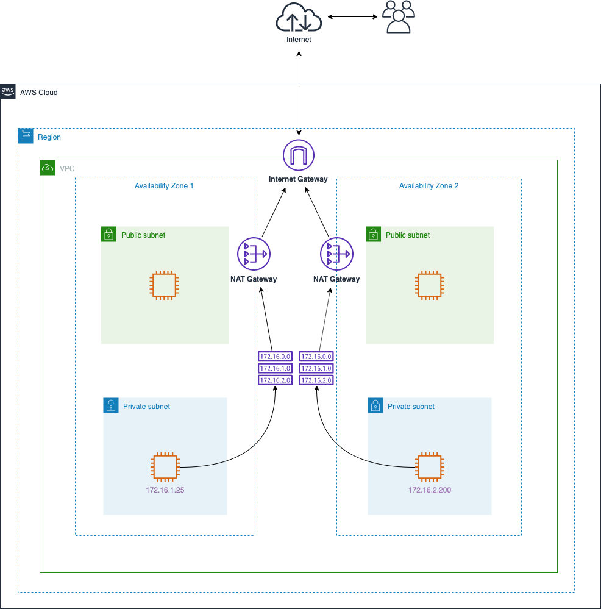
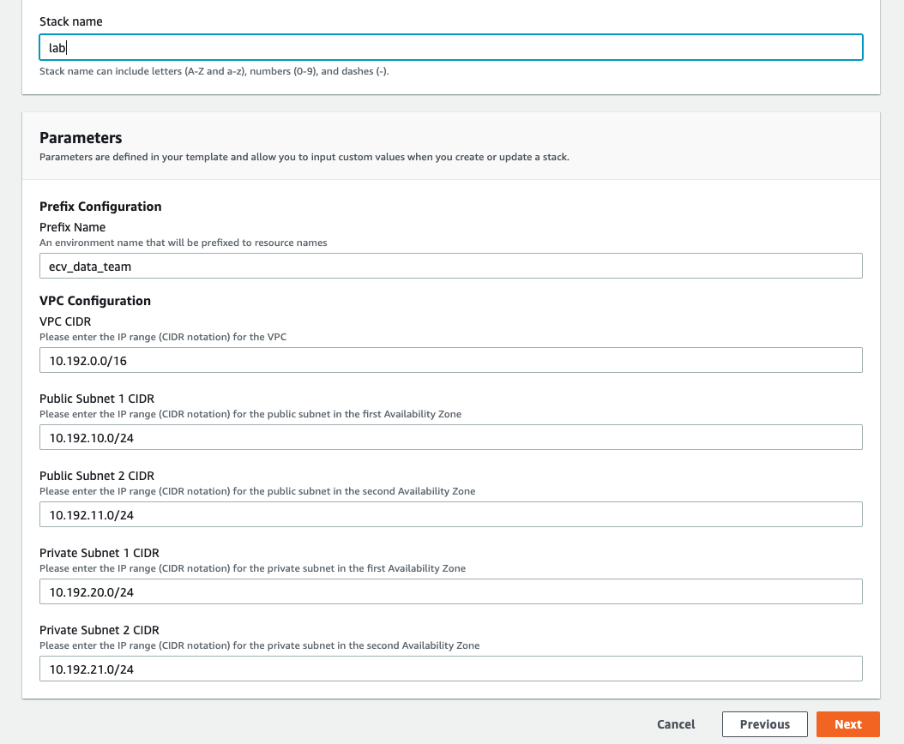
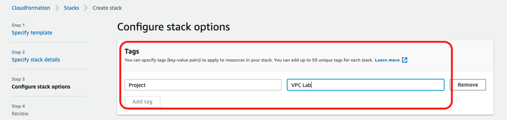
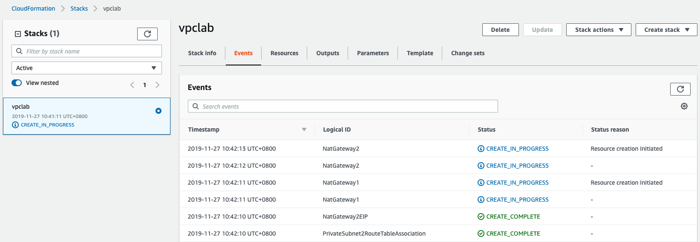
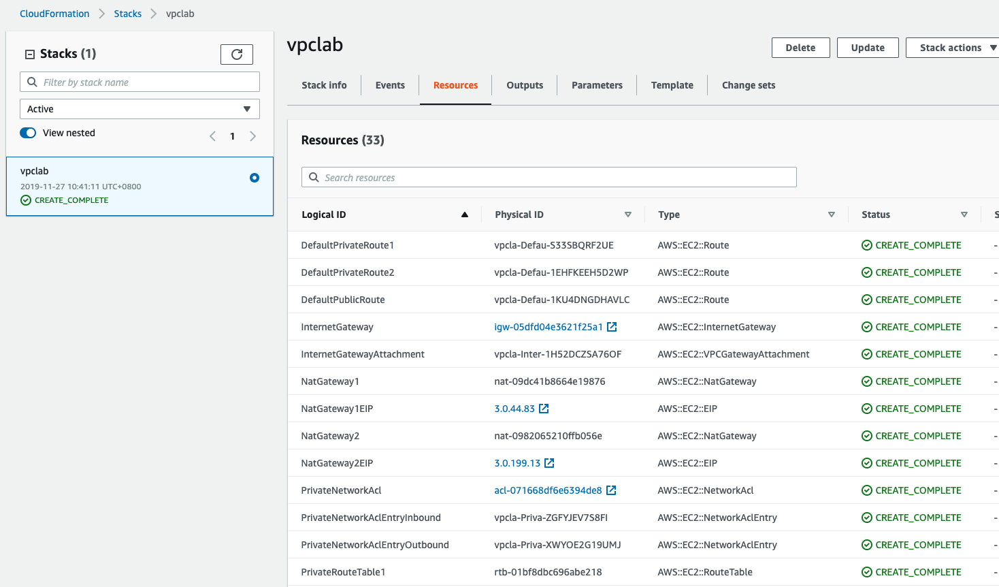
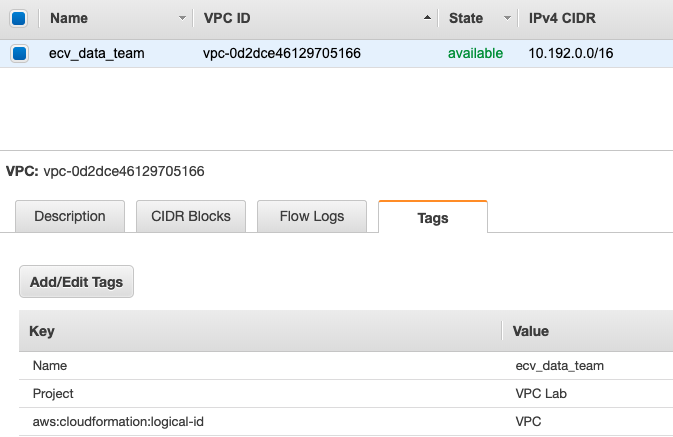
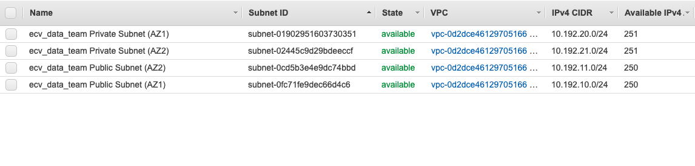
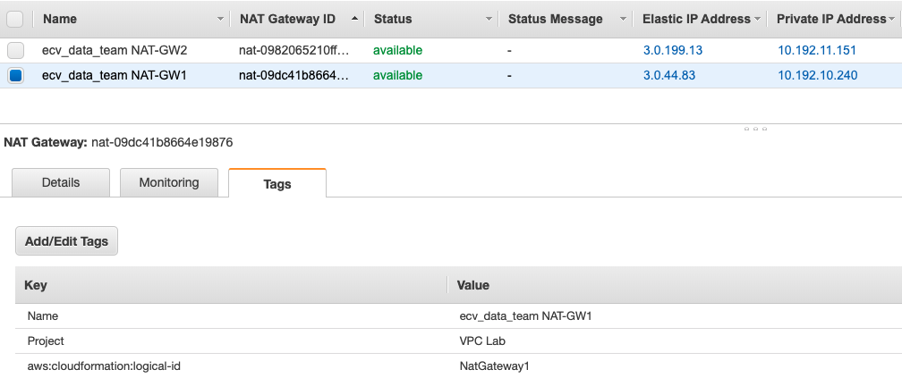

## About this lab

### VPC with private and public subnets in two Availability Zones

This lab is a fundamental VPC setup, therefore, it does not include any advanced infrastructure or complex network configuration

### Prerequisites
* You must have an AWS account and an IAM user with sufficient permissions to interact with the AWS Management Console

* Download the CloudFormation stack **vpc.yml** 

### CloudFormation Deployment
* On the service menu, click **CloudFormation**
* For **Prepare template**, choose **Template is ready**
* For **Specify template**, select **Upload a template file** and select **Choose file**.
* Choose the **vpc.yml**
* Click **Next**
* Enter the values in each Parameters and create the stack.
* Enter the parameters for **Prefix configuration** and **VPC configuration**
    * Make sure that **Prefix Name** must only contain lowercase letters and numbers or underscore (_)
    * Make sure the input parameters must match the pattern

* After entered every parameter and the stack name, click **Next**
* On **Configure stack options** page, add a stack-level tag with **Project** and **VPC Lab** as key and value

* Click **Next**
* Click **Create Stack**
* CloudFormation will start to build all resources

* Once stack finishes the creation the console will display as below

* You can go through the **VPC console** and check every resource you have created

***

***

### Clean-Up Operation Procedures

* On the service menu, click **CloudFormation**
* On AWS CloudFormation console make sure that the region is where you created the stack
* Click **Delete** to remove the stack along with all resources

### References
More illustrations of VPC design 
* [AWS Architecture Blog](https://aws.amazon.com/tw/blogs/architecture/one-to-many-evolving-vpc-design/)